# QPsdView Similarity Test Results

Generated on: 2025-06-13T14:14:09

## Summary Statistics

| Metric | Value |
|--------|-------|
| Total Tests | 149 |
| Passed Tests | 138 (92.6%) |
| Failed Tests | 11 |
| Average Similarity | 88.96% |
| Minimum Similarity | 25.00% |
| Maximum Similarity | 100.00% |

## Test Results

| File | Similarity | Status | PSD | QtPsd | Difference |
|------|------------|--------|-----|-------|------------|
| read/32bits/src.psd | 25.00%  | ❌ FAILED |  |  |  |
| write/empty/expected.psd | 25.00%  | ❌ FAILED |  |  |  |
| write/group-blend/expected.psd | 25.00%  | ❌ FAILED |  |  |  |
| write/layer-name/expected.psd | 25.00%  | ❌ FAILED |  |  |  |
| write/long-name/expected.psd | 25.00%  | ❌ FAILED |  |  |  |
| read/mesh-transform/Layer 1.psd | 25.00%  | ❌ FAILED |  |  |  |
| read/placed-transform/Layer 1.psd | 25.16%  | ❌ FAILED |  |  |  |
| write/vector/expected.psd | 29.72%  | ❌ FAILED |  |  | [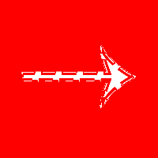](images/write_vector_expected_diff.png) |
| write/circle/expected.psd | 31.05%  | ❌ FAILED |  |  |  |
| write/no-background/expected.psd | 46.18%  | ❌ FAILED |  |  |  |
| write/effects/expected.psd | 47.25%  | ❌ FAILED |  |  |  |
| read/fill-opacity/src.psd | 63.82%  | ⚠️ LOW |  |  |  |
| read/lantern/src.psd | 65.03%  | ⚠️ LOW |  |  |  |
| write/smart-object/expected.psd | 67.08%  | ⚠️ LOW |  |  | [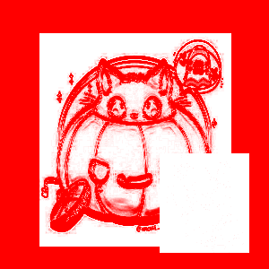](images/write_smart-object_expected_diff.png) |
| read/cmyk/src.psd | 67.53%  | ⚠️ LOW |  |  |  |
| read/16bits/src.psd | 68.38%  | ⚠️ LOW |  |  |  |
| read-write/round/expected.psd | 70.88%  | ⚠️ LOW | [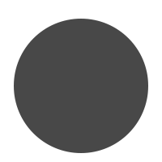](images/read-write_round_expected_toplevel.png) |  |  |
| read-write/round/src.psd | 70.88%  | ⚠️ LOW |  |  |  |
| read/round/src.psd | 70.88%  | ⚠️ LOW |  |  | [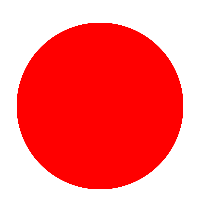](images/read_round_src_diff.png) |
| read/alpha-composite/src.psd | 75.65%  | ⚠️ LOW |  |  |  |
| read-write/vector-and-mask/expected.psd | 76.13%  | ⚠️ LOW |  |  |  |
| read-write/vector-and-mask/src.psd | 76.13%  | ⚠️ LOW |  |  |  |
| read/section/src.psd | 76.57%  | ⚠️ LOW |  |  |  |
| read/winding-non-zero/src.psd | 76.85%  | ⚠️ LOW |  |  |  |
| read-write/smart-filters/src.psd | 76.92%  | ⚠️ LOW |  |  |  |
| read-write/smart-filters/expected.psd | 76.92%  | ⚠️ LOW |  |  |  |
| read-write/winding-non-zero/expected.psd | 77.55%  | ⚠️ LOW |  |  |  |
| read-write/winding-non-zero/src.psd | 77.56%  | ⚠️ LOW |  |  |  |
| write/layer-mask/expected.psd | 79.08%  | ⚠️ LOW |  |  |  |
| read-write/cyllinder-warp/src.psd | 81.11%  | ⚠️ LOW |  |  |  |
| read-write/cyllinder-warp/expected.psd | 81.11%  | ⚠️ LOW |  |  |  |
| read/cyllinder-warp/src.psd | 81.11%  | ⚠️ LOW |  |  |  |
| read/winding-even-odd/src.psd | 83.68%  | ⚠️ LOW |  |  |  |
| read/bitmap/src.psd | 85.55%  | ⚠️ LOW |  |  | [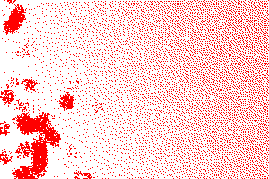](images/read_bitmap_src_diff.png) |
| read-write/smart-filters-2/src.psd | 86.63%  | ⚠️ LOW |  |  |  |
| read-write/smart-filters-2/expected.psd | 86.63%  | ⚠️ LOW |  |  |  |
| write/groups/expected.psd | 87.19%  | ⚠️ LOW |  |  |  |
| read/vector-layer/src.psd | 89.17%  | ⚠️ LOW |  |  |  |
| write/groups/original.psd | 89.59%  | ⚠️ LOW |  |  |  |
| read/layer-mask/src.psd | 89.93%  | ⚠️ LOW |  |  | [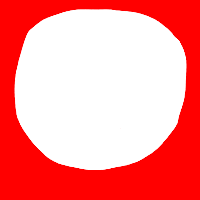](images/read_layer-mask_src_diff.png) |
| read/animation-timeline/src.psd | 90.39%  | ✅ GOOD |  |  |  |
| read-write/animation-timeline/expected.psd | 90.39%  | ✅ GOOD |  |  |  |
| read-write/animation-timeline/src.psd | 90.39%  | ✅ GOOD |  |  |  |
| read/animation-frame/src.psd | 90.90%  | ✅ GOOD |  |  |  |
| read-write/animation-frame/expected.psd | 90.90%  | ✅ GOOD |  |  |  |
| read-write/animation-frame/src.psd | 90.90%  | ✅ GOOD |  |  |  |
| read/smart-object-png/expected.psd | 91.43%  | ✅ GOOD |  |  |  |
| read/smart-object-png/src.psd | 91.43%  | ✅ GOOD |  |  |  |
| read-write/shapes/src.psd | 91.48%  | ✅ GOOD |  |  |  |
| read-write/shapes/expected.psd | 91.48%  | ✅ GOOD |  |  |  |
| multiple-strokes-test.psd | 91.76%  | ✅ GOOD |  |  |  |
| read/grayscale-alpha/src.psd | 92.33%  | ✅ GOOD |  |  | [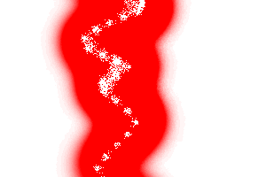](images/read_grayscale-alpha_src_diff.png) |
| read-write/gradient-mode/src.psd | 92.68%  | ✅ GOOD |  |  |  |
| read-write/gradient-mode/expected.psd | 92.68%  | ✅ GOOD |  |  | [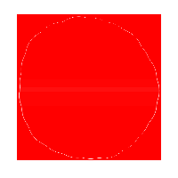](images/read-write_gradient-mode_expected_diff.png) |
| read-write/gradient/src.psd | 93.92%  | ✅ GOOD |  |  | [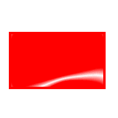](images/read-write_gradient_src_diff.png) |
| read/gradient/src.psd | 93.92%  | ✅ GOOD |  |  |  |
| read-write/gradient/expected.psd | 94.89%  | ✅ GOOD |  |  |  |
| read/pattern/src.psd | 96.11%  | ✅ GOOD | [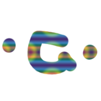](images/read_pattern_src_toplevel.png) |  |  |
| read-write/effects/expected.psd | 96.40%  | ✅ GOOD |  |  |  |
| read-write/effects/src.psd | 96.42%  | ✅ GOOD |  |  |  |
| read-write/layer-comps/expected.psd | 96.46%  | ✅ GOOD |  |  |  |
| read-write/layer-comps/src.psd | 96.46%  | ✅ GOOD |  |  |  |
| read/layer-comps/src.psd | 96.46%  | ✅ GOOD |  |  |  |
| write/layer-offsets/expected.psd | 96.48%  | ✅ GOOD |  |  |  |
| read/layer-offsets-read/src.psd | 96.48%  | ✅ GOOD |  |  |  |
| read/effects/src.psd | 96.69%  | ✅ GOOD |  |  |  |
| read/alias/src.psd | 97.17%  | ✅ GOOD | [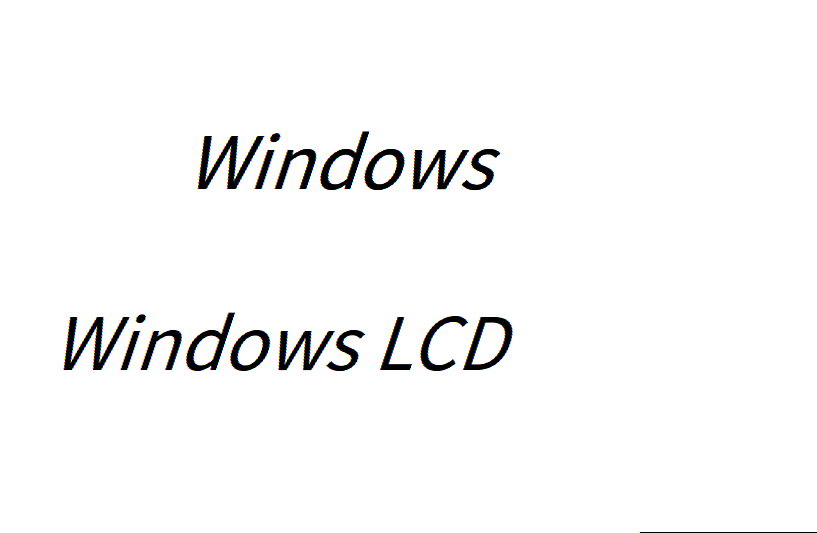](images/read_alias_src_toplevel.png) | [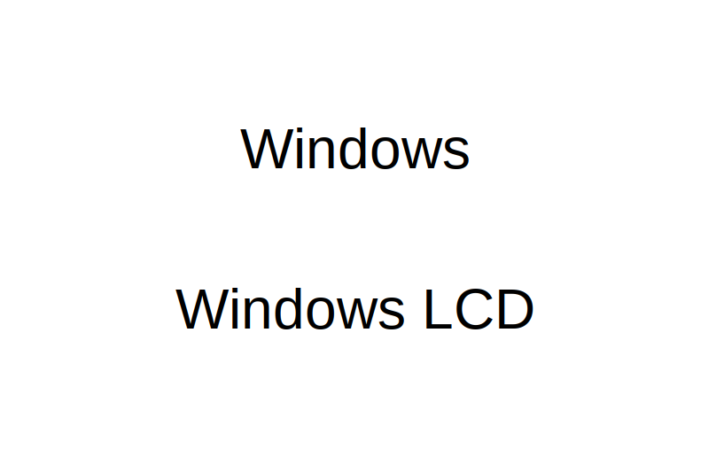](images/read_alias_src_view.png) |  |
| read/smart-object/src.psd | 97.32%  | ✅ GOOD |  |  |  |
| read-write/smart/src.psd | 97.32%  | ✅ GOOD |  |  |  |
| read-write/smart/expected.psd | 97.32%  | ✅ GOOD |  |  | [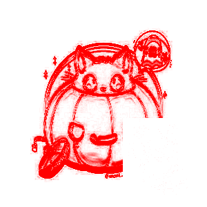](images/read-write_smart_expected_diff.png) |
| read/text-paragraph-align/src.psd | 97.80%  | ✅ GOOD |  | [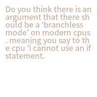](images/read_text-paragraph-align_src_view.png) |  |
| write/complex/expected.psd | 97.85%  | ✅ GOOD |  |  |  |
| read/text-simple2/src.psd | 98.02%  | ✅ GOOD |  |  |  |
| read-write/boolean/expected.psd | 98.08%  | ✅ GOOD |  |  |  |
| read-write/boolean/src.psd | 98.08%  | ✅ GOOD |  |  |  |
| read/text-simple/src.psd | 98.09%  | ✅ GOOD |  |  |  |
| read/text-complex/src.psd | 98.11%  | ✅ GOOD |  |  |  |
| read-write/strokes/expected.psd | 98.12%  | ✅ GOOD |  |  |  |
| read-write/strokes/src.psd | 98.16%  | ✅ GOOD |  |  |  |
| write/vector/src.psd | 98.59%  | ✅ GOOD |  |  |  |
| read/vector-complex/src.psd | 98.59%  | ✅ GOOD |  |  |  |
| read-write/stroke/src.psd | 98.59%  | ✅ GOOD |  |  |  |
| read-write/stroke/expected.psd | 98.59%  | ✅ GOOD |  |  |  |
| read-write/animation-offset/expected.psd | 98.71%  | ✅ GOOD |  |  |  |
| read/animation-offset/src.psd | 98.71%  | ✅ GOOD |  |  |  |
| read-write/animation-offset/src.psd | 98.71%  | ✅ GOOD |  |  |  |
| read/blend-mode/src.psd | 98.76%  | ✅ GOOD |  |  |  |
| write/write-text2/expected.psd | 98.87%  | ✅ GOOD |  |  |  |
| write/write-text/expected.psd | 98.87%  | ✅ GOOD |  |  |  |
| read/text-layer/src.psd | 98.87%  | ✅ GOOD |  |  |  |
| read-write/animation-effects/src.psd | 99.06%  | ✅ PERFECT |  |  |  |
| read/animation-effects/src.psd | 99.06%  | ✅ PERFECT |  |  |  |
| read-write/animation-effects/expected.psd | 99.06%  | ✅ PERFECT |  |  |  |
| write/simple-compress/expected.psd | 99.17%  | ✅ PERFECT |  |  |  |
| write/simple/expected.psd | 99.17%  | ✅ PERFECT |  |  |  |
| write/layer-color/expected.psd | 99.17%  | ✅ PERFECT |  |  |  |
| read-write/group-blend/expected.psd | 99.19%  | ✅ PERFECT |  |  | [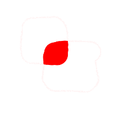](images/read-write_group-blend_expected_diff.png) |
| read-write/group-blend/src.psd | 99.20%  | ✅ PERFECT |  |  |  |
| read-write/float-color/expected.psd | 99.29%  | ✅ PERFECT |  |  |  |
| read-write/float-color/src.psd | 99.29%  | ✅ PERFECT | [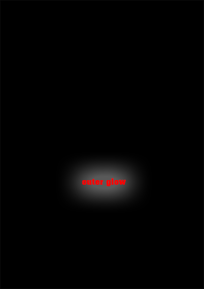](images/read-write_float-color_src_toplevel.png) | [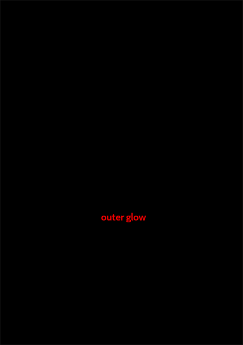](images/read-write_float-color_src_view.png) |  |
| read-write/text-box/expected.psd | 99.35%  | ✅ PERFECT |  | [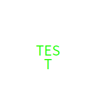](images/read-write_text-box_expected_view.png) |  |
| read-write/text-box/src.psd | 99.35%  | ✅ PERFECT |  |  |  |
| text-test.psd | 99.35%  | ✅ PERFECT |  |  | [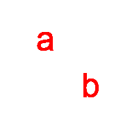](images/text-test_diff.png) |
| read/adjustment-layers/src.psd | 99.37%  | ✅ PERFECT |  |  |  |
| read-write/adjustments/src.psd | 99.37%  | ✅ PERFECT |  |  |  |
| read-write/adjustments/expected.psd | 99.37%  | ✅ PERFECT |  |  |  |
| read/text-alternatives/src.psd | 99.38%  | ✅ PERFECT |  |  |  |
| read/bitmap-rle/src.psd | 99.52%  | ✅ PERFECT |  |  |  |
| read-write/text/expected.psd | 99.53%  | ✅ PERFECT |  |  |  |
| read-write/text/src.psd | 99.53%  | ✅ PERFECT |  |  |  |
| text-simple.psd | 99.68%  | ✅ PERFECT |  |  | [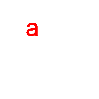](images/text-simple_diff.png) |
| read-write/masks/src.psd | 99.69%  | ✅ PERFECT |  |  |  |
| read-write/masks/expected.psd | 99.69%  | ✅ PERFECT |  |  |  |
| read/text-path/src.psd | 99.74%  | ✅ PERFECT |  |  |  |
| write/float-size/expected.psd | 99.84%  | ✅ PERFECT |  |  |  |
| read/text-bug/src.psd | 99.85%  | ✅ PERFECT |  |  |  |
| read/artboards/src.psd | 99.86%  | ✅ PERFECT |  |  |  |
| read-write/artboards/expected.psd | 99.86%  | ✅ PERFECT |  |  |  |
| read-write/artboards/src.psd | 99.86%  | ✅ PERFECT |  |  |  |
| read-write/vectors/src.psd | 99.89%  | ✅ PERFECT |  |  |  |
| read/text-carriage-return/src.psd | 99.93%  | ✅ PERFECT | [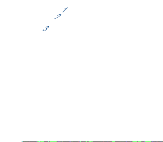](images/read_text-carriage-return_src_toplevel.png) |  | [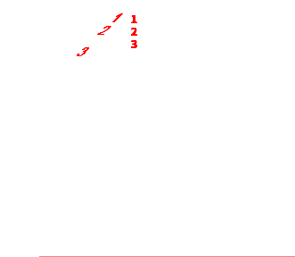](images/read_text-carriage-return_src_diff.png) |
| read-write/vectors/expected.psd | 99.97%  | ✅ PERFECT |  |  |  |
| vector-test.psd | 99.97%  | ✅ PERFECT |  |  | [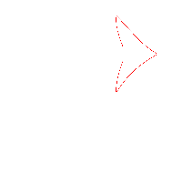](images/vector-test_diff.png) |
| read/sai/src.psd | 99.98%  | ✅ PERFECT |  |  |  |
| read/groups/src.psd | 99.99%  | ✅ PERFECT |  | [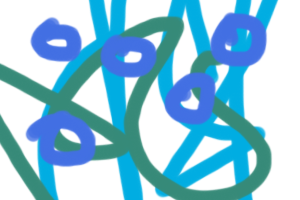](images/read_groups_src_view.png) | [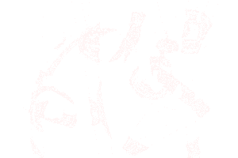](images/read_groups_src_diff.png) |
| read/key-origin-shape-bbox/src.psd | 100.00%  | ✅ PERFECT |  |  |  |
| read/section-2/src.psd | 100.00%  | ✅ PERFECT |  |  |  |
| read/mesh-transform/src.psd | 100.00%  | ✅ PERFECT |  |  | [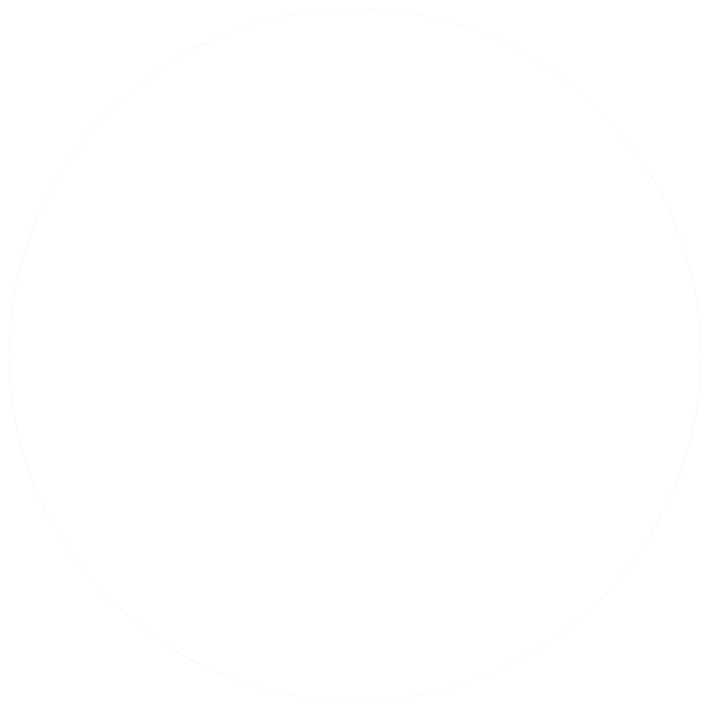](images/read_mesh-transform_src_diff.png) |
| test.psd | 100.00%  | ✅ PERFECT |  |  | [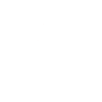](images/test_diff.png) |
| read/placed-transform/src.psd | 100.00%  | ✅ PERFECT |  |  |  |
| read/rle-fail/src.psd | 100.00%  | ✅ PERFECT |  | [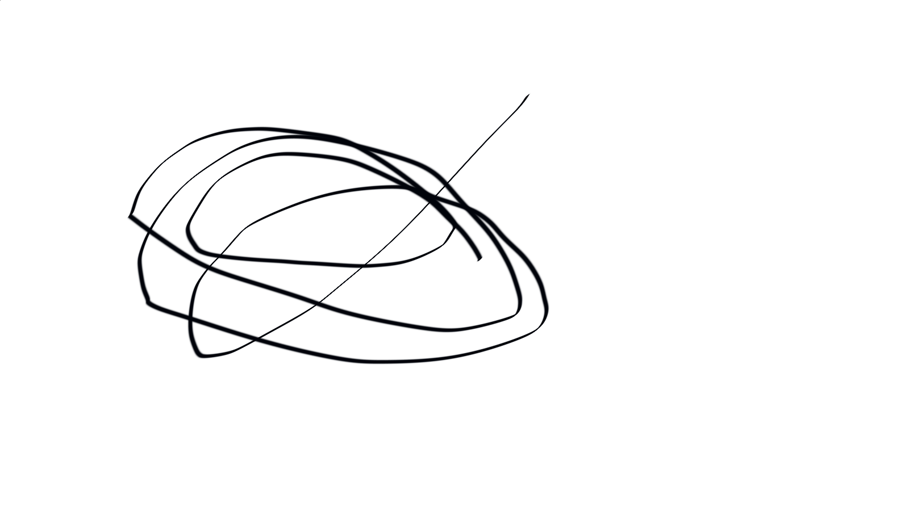](images/read_rle-fail_src_view.png) |  |
| read/layers/src.psd | 100.00%  | ✅ PERFECT |  |  |  |
| layer-mask/src.psd | 100.00%  | ✅ PERFECT |  |  |  |
| timeline.psd | 100.00%  | ✅ PERFECT |  |  |  |
| read/background/src.psd | 100.00%  | ✅ PERFECT |  |  |  |
| read/cat/src.psd | 100.00%  | ✅ PERFECT |  |  |  |
| read/count/src.psd | 100.00%  | ✅ PERFECT |  |  |  |
| read/grayscale/src.psd | 100.00%  | ✅ PERFECT |  |  |  |
| read/guides/src.psd | 100.00%  | ✅ PERFECT |  |  |  |
| read/just-bg/src.psd | 100.00%  | ✅ PERFECT |  |  |  |
| read/layer-larger-than-drawing/src.psd | 100.00%  | ✅ PERFECT |  |  |  |
| write/auto-lead/expected.psd | 100.00%  | ✅ PERFECT |  |  |  |
| read/nested/src.psd | 100.00%  | ✅ PERFECT |  |  |  |
| read/pass-through/src.psd | 100.00%  | ✅ PERFECT |  |  |  |
| read/slices/src.psd | 100.00%  | ✅ PERFECT |  |  |  |
| read-write/annotations/expected.psd | 100.00%  | ✅ PERFECT |  |  |  |
| read-write/annotations/src.psd | 100.00%  | ✅ PERFECT |  |  |  |
| read-write/werps/expected.psd | 100.00%  | ✅ PERFECT |  |  |  |
| read-write/werps/src.psd | 100.00%  | ✅ PERFECT |  |  |  |
