# QPsdView Similarity Test Results

Generated on: 2025-06-14T16:33:22

## Summary Statistics

| Metric | psd2png vs imageData | psd2png vs psdView |
|--------|---------------------|-------------------|
| Total Tests | 145 | 145 |
| Passed Tests (>50%) | 120 (82.8%) | 121 (83.4%) |
| Average Similarity | 75.38% | 76.28% |
| Minimum Similarity | 0.00% | 5.24% |
| Maximum Similarity | 100.00% | 100.00% |

**Note:** 0 tests had no psd2png reference image for comparison.

## Section 1: psd2png vs imageData

| File | Similarity | Status | psd2png | imageData | Difference |
|------|------------|--------|---------|-----------|------------|
| [write/long-name/expected.psd](https://github.com/Agamnentzar/ag-psd/tree/master/test/write/long-name/expected.psd) | 0.00%  | ❌ FAILED |  |  |  |
| [write/empty/expected.psd](https://github.com/Agamnentzar/ag-psd/tree/master/test/write/empty/expected.psd) | 0.00%  | ❌ FAILED |  |  |  |
| [write/layer-name/expected.psd](https://github.com/Agamnentzar/ag-psd/tree/master/test/write/layer-name/expected.psd) | 0.00%  | ❌ FAILED |  |  |  |
| [read-write/stroke/src.psd](https://github.com/Agamnentzar/ag-psd/tree/master/test/read-write/stroke/src.psd) | 4.19%  | ❌ FAILED |  |  |  |
| [read-write/stroke/expected.psd](https://github.com/Agamnentzar/ag-psd/tree/master/test/read-write/stroke/expected.psd) | 4.19%  | ❌ FAILED |  |  |  |
| [read/blend-mode/src.psd](https://github.com/Agamnentzar/ag-psd/tree/master/test/read/blend-mode/src.psd) | 12.81%  | ❌ FAILED |  |  |  |
| [read/adjustment-layers/src.psd](https://github.com/Agamnentzar/ag-psd/tree/master/test/read/adjustment-layers/src.psd) | 17.61%  | ❌ FAILED |  |  | [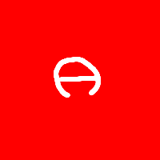](images/imagedata/ag-psd/read/adjustment-layers/src_diff.png) |
| [read-write/adjustments/src.psd](https://github.com/Agamnentzar/ag-psd/tree/master/test/read-write/adjustments/src.psd) | 17.61%  | ❌ FAILED |  |  |  |
| [read-write/adjustments/expected.psd](https://github.com/Agamnentzar/ag-psd/tree/master/test/read-write/adjustments/expected.psd) | 17.62%  | ❌ FAILED |  |  |  |
| [write/vector/expected.psd](https://github.com/Agamnentzar/ag-psd/tree/master/test/write/vector/expected.psd) | 18.10%  | ❌ FAILED |  | [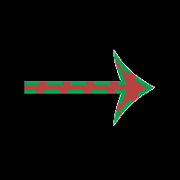](images/imagedata/ag-psd/write/vector/expected.png) |  |
| [read/winding-even-odd/src.psd](https://github.com/Agamnentzar/ag-psd/tree/master/test/read/winding-even-odd/src.psd) | 21.41%  | ❌ FAILED |  | [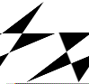](images/imagedata/ag-psd/read/winding-even-odd/src.png) |  |
| [write/effects/expected.psd](https://github.com/Agamnentzar/ag-psd/tree/master/test/write/effects/expected.psd) | 23.86%  | ❌ FAILED |  |  | [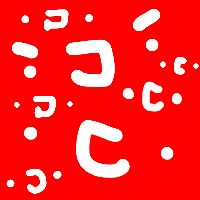](images/imagedata/ag-psd/write/effects/expected_diff.png) |
| [read/lantern/src.psd](https://github.com/Agamnentzar/ag-psd/tree/master/test/read/lantern/src.psd) | 23.95%  | ❌ FAILED |  |  |  |
| [read/bitmap-rle/src.psd](https://github.com/Agamnentzar/ag-psd/tree/master/test/read/bitmap-rle/src.psd) | 25.00%  | ❌ FAILED |  |  |  |
| [read/bitmap/src.psd](https://github.com/Agamnentzar/ag-psd/tree/master/test/read/bitmap/src.psd) | 25.00%  | ❌ FAILED | [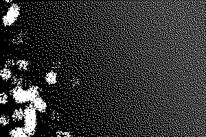](images/psd2png/ag-psd/read/bitmap/src.png) | [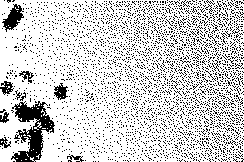](images/imagedata/ag-psd/read/bitmap/src.png) | [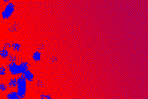](images/imagedata/ag-psd/read/bitmap/src_diff.png) |
| [read-write/boolean/src.psd](https://github.com/Agamnentzar/ag-psd/tree/master/test/read-write/boolean/src.psd) | 27.88%  | ❌ FAILED |  |  |  |
| [read-write/boolean/expected.psd](https://github.com/Agamnentzar/ag-psd/tree/master/test/read-write/boolean/expected.psd) | 27.88%  | ❌ FAILED |  |  |  |
| [read-write/winding-non-zero/src.psd](https://github.com/Agamnentzar/ag-psd/tree/master/test/read-write/winding-non-zero/src.psd) | 30.11%  | ❌ FAILED |  |  |  |
| [read-write/winding-non-zero/expected.psd](https://github.com/Agamnentzar/ag-psd/tree/master/test/read-write/winding-non-zero/expected.psd) | 30.11%  | ❌ FAILED |  |  |  |
| [read/winding-non-zero/src.psd](https://github.com/Agamnentzar/ag-psd/tree/master/test/read/winding-non-zero/src.psd) | 30.58%  | ❌ FAILED |  |  |  |
| [read/32bits/src.psd](https://github.com/Agamnentzar/ag-psd/tree/master/test/read/32bits/src.psd) | 39.86%  | ❌ FAILED |  |  | [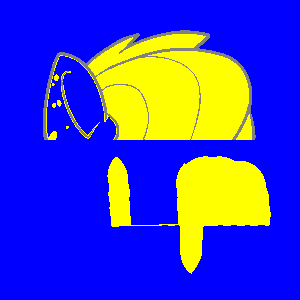](images/imagedata/ag-psd/read/32bits/src_diff.png) |
| [read/text-simple2/src.psd](https://github.com/Agamnentzar/ag-psd/tree/master/test/read/text-simple2/src.psd) | 43.60%  | ❌ FAILED |  |  |  |
| [read-write/vector-and-mask/src.psd](https://github.com/Agamnentzar/ag-psd/tree/master/test/read-write/vector-and-mask/src.psd) | 44.67%  | ❌ FAILED |  |  |  |
| [read-write/vector-and-mask/expected.psd](https://github.com/Agamnentzar/ag-psd/tree/master/test/read-write/vector-and-mask/expected.psd) | 44.67%  | ❌ FAILED |  |  | [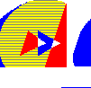](images/imagedata/ag-psd/read-write/vector-and-mask/expected_diff.png) |
| [read/vector-layer/src.psd](https://github.com/Agamnentzar/ag-psd/tree/master/test/read/vector-layer/src.psd) | 47.96%  | ❌ FAILED |  |  |  |
| [read/alpha-composite/src.psd](https://github.com/Agamnentzar/ag-psd/tree/master/test/read/alpha-composite/src.psd) | 51.78%  | ⚠️ LOW |  |  |  |
| [read-write/animation-timeline/src.psd](https://github.com/Agamnentzar/ag-psd/tree/master/test/read-write/animation-timeline/src.psd) | 54.48%  | ⚠️ LOW |  |  |  |
| [read/animation-timeline/src.psd](https://github.com/Agamnentzar/ag-psd/tree/master/test/read/animation-timeline/src.psd) | 54.48%  | ⚠️ LOW |  |  |  |
| [read-write/animation-timeline/expected.psd](https://github.com/Agamnentzar/ag-psd/tree/master/test/read-write/animation-timeline/expected.psd) | 54.48%  | ⚠️ LOW |  |  |  |
| [write/group-blend/expected.psd](https://github.com/Agamnentzar/ag-psd/tree/master/test/write/group-blend/expected.psd) | 54.97%  | ⚠️ LOW |  |  | [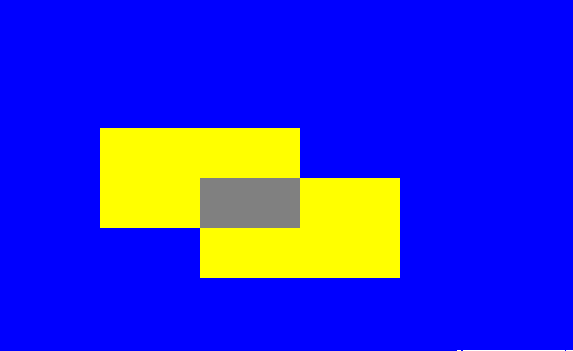](images/imagedata/ag-psd/write/group-blend/expected_diff.png) |
| [test.psd](https://github.com/Agamnentzar/ag-psd/tree/master/test/test.psd) | 57.12%  | ⚠️ LOW |  |  | [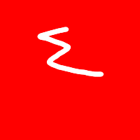](images/imagedata/ag-psd/test_diff.png) |
| [read-write/smart-filters/expected.psd](https://github.com/Agamnentzar/ag-psd/tree/master/test/read-write/smart-filters/expected.psd) | 58.36%  | ⚠️ LOW |  |  |  |
| [read-write/smart-filters/src.psd](https://github.com/Agamnentzar/ag-psd/tree/master/test/read-write/smart-filters/src.psd) | 58.36%  | ⚠️ LOW |  |  |  |
| [write/smart-object/expected.psd](https://github.com/Agamnentzar/ag-psd/tree/master/test/write/smart-object/expected.psd) | 59.67%  | ⚠️ LOW |  |  | [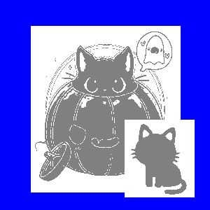](images/imagedata/ag-psd/write/smart-object/expected_diff.png) |
| [read-write/round/src.psd](https://github.com/Agamnentzar/ag-psd/tree/master/test/read-write/round/src.psd) | 63.82%  | ⚠️ LOW |  | [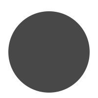](images/imagedata/ag-psd/read-write/round/src.png) | [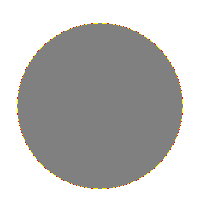](images/imagedata/ag-psd/read-write/round/src_diff.png) |
| [read/round/src.psd](https://github.com/Agamnentzar/ag-psd/tree/master/test/read/round/src.psd) | 63.82%  | ⚠️ LOW |  |  | [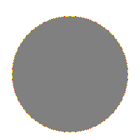](images/imagedata/ag-psd/read/round/src_diff.png) |
| [read-write/round/expected.psd](https://github.com/Agamnentzar/ag-psd/tree/master/test/read-write/round/expected.psd) | 63.82%  | ⚠️ LOW |  |  | [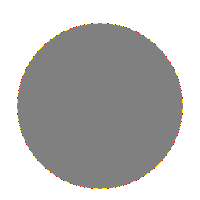](images/imagedata/ag-psd/read-write/round/expected_diff.png) |
| [read/text-simple/src.psd](https://github.com/Agamnentzar/ag-psd/tree/master/test/read/text-simple/src.psd) | 64.18%  | ⚠️ LOW |  |  |  |
| [write/layer-mask/expected.psd](https://github.com/Agamnentzar/ag-psd/tree/master/test/write/layer-mask/expected.psd) | 65.27%  | ⚠️ LOW |  |  |  |
| [read/vector-complex/src.psd](https://github.com/Agamnentzar/ag-psd/tree/master/test/read/vector-complex/src.psd) | 65.29%  | ⚠️ LOW |  |  |  |
| [write/vector/src.psd](https://github.com/Agamnentzar/ag-psd/tree/master/test/write/vector/src.psd) | 65.29%  | ⚠️ LOW |  |  | [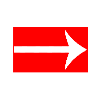](images/imagedata/ag-psd/write/vector/src_diff.png) |
| [vector-test.psd](https://github.com/Agamnentzar/ag-psd/tree/master/test/vector-test.psd) | 65.89%  | ⚠️ LOW |  | [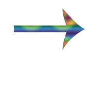](images/imagedata/ag-psd/vector-test.png) |  |
| [write/circle/expected.psd](https://github.com/Agamnentzar/ag-psd/tree/master/test/write/circle/expected.psd) | 66.14%  | ⚠️ LOW |  | [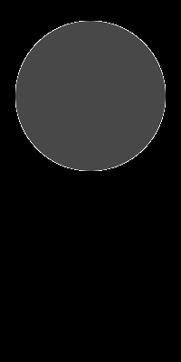](images/imagedata/ag-psd/write/circle/expected.png) |  |
| [read/pattern/src.psd](https://github.com/Agamnentzar/ag-psd/tree/master/test/read/pattern/src.psd) | 67.51%  | ⚠️ LOW | [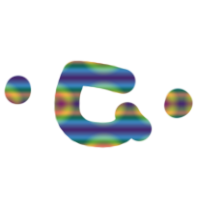](images/psd2png/ag-psd/read/pattern/src.png) |  |  |
| [read/smart-object-png/expected.psd](https://github.com/Agamnentzar/ag-psd/tree/master/test/read/smart-object-png/expected.psd) | 68.00%  | ⚠️ LOW |  |  |  |
| [read/smart-object-png/src.psd](https://github.com/Agamnentzar/ag-psd/tree/master/test/read/smart-object-png/src.psd) | 68.00%  | ⚠️ LOW |  |  |  |
| [read-write/text/src.psd](https://github.com/Agamnentzar/ag-psd/tree/master/test/read-write/text/src.psd) | 74.13%  | ⚠️ LOW |  |  |  |
| [read-write/text/expected.psd](https://github.com/Agamnentzar/ag-psd/tree/master/test/read-write/text/expected.psd) | 74.13%  | ⚠️ LOW |  |  |  |
| [read-write/text-box/src.psd](https://github.com/Agamnentzar/ag-psd/tree/master/test/read-write/text-box/src.psd) | 74.20%  | ⚠️ LOW |  |  |  |
| [read-write/text-box/expected.psd](https://github.com/Agamnentzar/ag-psd/tree/master/test/read-write/text-box/expected.psd) | 74.20%  | ⚠️ LOW |  |  |  |
| [read/cat/src.psd](https://github.com/Agamnentzar/ag-psd/tree/master/test/read/cat/src.psd) | 74.32%  | ⚠️ LOW |  |  |  |
| [layer-mask/src.psd](https://github.com/Agamnentzar/ag-psd/tree/master/test/layer-mask/src.psd) | 74.32%  | ⚠️ LOW |  |  |  |
| [read-write/masks/src.psd](https://github.com/Agamnentzar/ag-psd/tree/master/test/read-write/masks/src.psd) | 74.74%  | ⚠️ LOW |  |  | [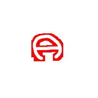](images/imagedata/ag-psd/read-write/masks/src_diff.png) |
| [read-write/masks/expected.psd](https://github.com/Agamnentzar/ag-psd/tree/master/test/read-write/masks/expected.psd) | 74.74%  | ⚠️ LOW |  |  |  |
| [text-test.psd](https://github.com/Agamnentzar/ag-psd/tree/master/test/text-test.psd) | 74.83%  | ⚠️ LOW | [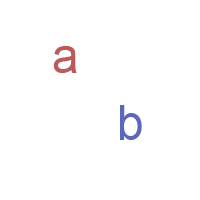](images/psd2png/ag-psd/text-test.png) | [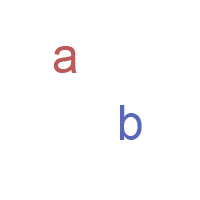](images/imagedata/ag-psd/text-test.png) |  |
| [text-simple.psd](https://github.com/Agamnentzar/ag-psd/tree/master/test/text-simple.psd) | 74.90%  | ⚠️ LOW |  | [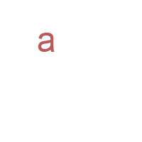](images/imagedata/ag-psd/text-simple.png) | [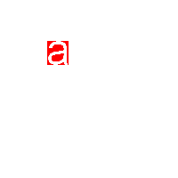](images/imagedata/ag-psd/text-simple_diff.png) |
| [read/pass-through/src.psd](https://github.com/Agamnentzar/ag-psd/tree/master/test/read/pass-through/src.psd) | 75.00%  | ⚠️ LOW |  |  |  |
| [write/auto-lead/expected.psd](https://github.com/Agamnentzar/ag-psd/tree/master/test/write/auto-lead/expected.psd) | 75.00%  | ⚠️ LOW |  |  |  |
| [read/effects/src.psd](https://github.com/Agamnentzar/ag-psd/tree/master/test/read/effects/src.psd) | 75.22%  | ⚠️ LOW | [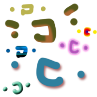](images/psd2png/ag-psd/read/effects/src.png) |  | [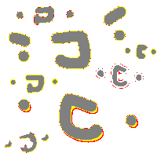](images/imagedata/ag-psd/read/effects/src_diff.png) |
| [read-write/effects/src.psd](https://github.com/Agamnentzar/ag-psd/tree/master/test/read-write/effects/src.psd) | 75.33%  | ⚠️ LOW | [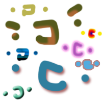](images/psd2png/ag-psd/read-write/effects/src.png) |  | [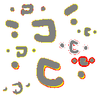](images/imagedata/ag-psd/read-write/effects/src_diff.png) |
| [read-write/effects/expected.psd](https://github.com/Agamnentzar/ag-psd/tree/master/test/read-write/effects/expected.psd) | 75.35%  | ⚠️ LOW |  | [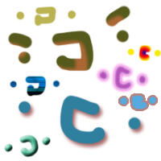](images/imagedata/ag-psd/read-write/effects/expected.png) | [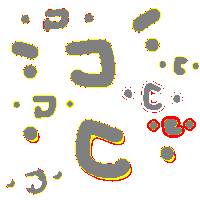](images/imagedata/ag-psd/read-write/effects/expected_diff.png) |
| [read/sai/src.psd](https://github.com/Agamnentzar/ag-psd/tree/master/test/read/sai/src.psd) | 76.06%  | ⚠️ LOW |  |  |  |
| [read/mesh-transform/src.psd](https://github.com/Agamnentzar/ag-psd/tree/master/test/read/mesh-transform/src.psd) | 78.45%  | ⚠️ LOW |  |  | [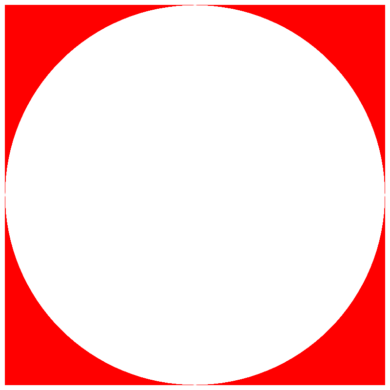](images/imagedata/ag-psd/read/mesh-transform/src_diff.png) |
| [write/no-background/expected.psd](https://github.com/Agamnentzar/ag-psd/tree/master/test/write/no-background/expected.psd) | 78.61%  | ⚠️ LOW |  |  | [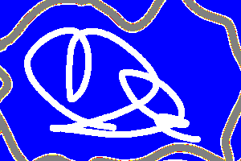](images/imagedata/ag-psd/write/no-background/expected_diff.png) |
| [read/cyllinder-warp/src.psd](https://github.com/Agamnentzar/ag-psd/tree/master/test/read/cyllinder-warp/src.psd) | 81.06%  | ⚠️ LOW |  |  | [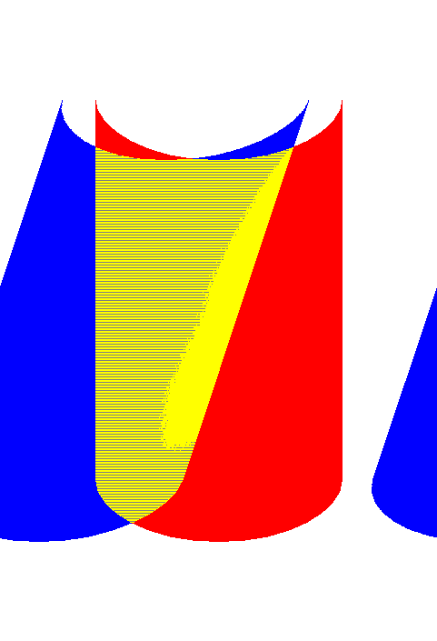](images/imagedata/ag-psd/read/cyllinder-warp/src_diff.png) |
| [read-write/cyllinder-warp/src.psd](https://github.com/Agamnentzar/ag-psd/tree/master/test/read-write/cyllinder-warp/src.psd) | 81.09%  | ⚠️ LOW |  |  |  |
| [read-write/cyllinder-warp/expected.psd](https://github.com/Agamnentzar/ag-psd/tree/master/test/read-write/cyllinder-warp/expected.psd) | 81.09%  | ⚠️ LOW |  |  |  |
| [read-write/group-blend/src.psd](https://github.com/Agamnentzar/ag-psd/tree/master/test/read-write/group-blend/src.psd) | 81.33%  | ⚠️ LOW |  |  |  |
| [read-write/group-blend/expected.psd](https://github.com/Agamnentzar/ag-psd/tree/master/test/read-write/group-blend/expected.psd) | 81.34%  | ⚠️ LOW |  |  |  |
| [read-write/gradient-mode/src.psd](https://github.com/Agamnentzar/ag-psd/tree/master/test/read-write/gradient-mode/src.psd) | 82.21%  | ⚠️ LOW |  |  | [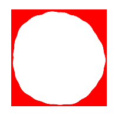](images/imagedata/ag-psd/read-write/gradient-mode/src_diff.png) |
| [read-write/gradient-mode/expected.psd](https://github.com/Agamnentzar/ag-psd/tree/master/test/read-write/gradient-mode/expected.psd) | 82.21%  | ⚠️ LOW |  |  |  |
| [read/layer-mask/src.psd](https://github.com/Agamnentzar/ag-psd/tree/master/test/read/layer-mask/src.psd) | 82.78%  | ⚠️ LOW |  |  |  |
| [read/groups/src.psd](https://github.com/Agamnentzar/ag-psd/tree/master/test/read/groups/src.psd) | 83.14%  | ⚠️ LOW |  |  | [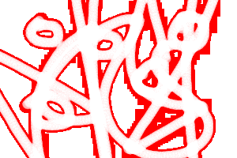](images/imagedata/ag-psd/read/groups/src_diff.png) |
| [read-write/artboards/expected.psd](https://github.com/Agamnentzar/ag-psd/tree/master/test/read-write/artboards/expected.psd) | 83.41%  | ⚠️ LOW |  |  |  |
| [read/artboards/src.psd](https://github.com/Agamnentzar/ag-psd/tree/master/test/read/artboards/src.psd) | 83.41%  | ⚠️ LOW |  |  |  |
| [read-write/artboards/src.psd](https://github.com/Agamnentzar/ag-psd/tree/master/test/read-write/artboards/src.psd) | 83.41%  | ⚠️ LOW |  |  | [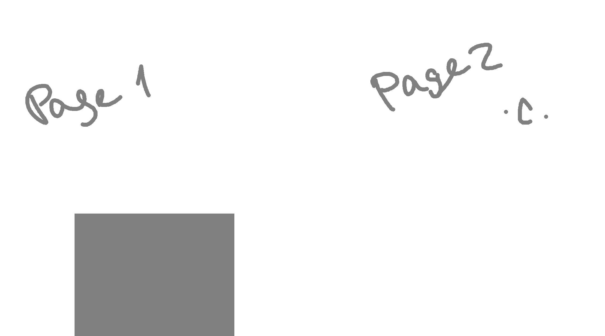](images/imagedata/ag-psd/read-write/artboards/src_diff.png) |
| [read-write/smart-filters-2/src.psd](https://github.com/Agamnentzar/ag-psd/tree/master/test/read-write/smart-filters-2/src.psd) | 83.43%  | ⚠️ LOW |  |  | [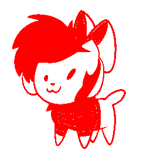](images/imagedata/ag-psd/read-write/smart-filters-2/src_diff.png) |
| [read-write/smart-filters-2/expected.psd](https://github.com/Agamnentzar/ag-psd/tree/master/test/read-write/smart-filters-2/expected.psd) | 83.43%  | ⚠️ LOW |  |  |  |
| [read/fill-opacity/src.psd](https://github.com/Agamnentzar/ag-psd/tree/master/test/read/fill-opacity/src.psd) | 84.31%  | ⚠️ LOW |  |  |  |
| [read/grayscale-alpha/src.psd](https://github.com/Agamnentzar/ag-psd/tree/master/test/read/grayscale-alpha/src.psd) | 85.74%  | ⚠️ LOW |  |  | [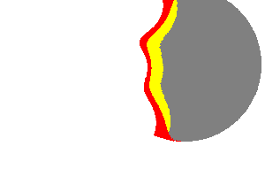](images/imagedata/ag-psd/read/grayscale-alpha/src_diff.png) |
| [multiple-strokes-test.psd](https://github.com/Agamnentzar/ag-psd/tree/master/test/multiple-strokes-test.psd) | 89.29%  | ⚠️ LOW | [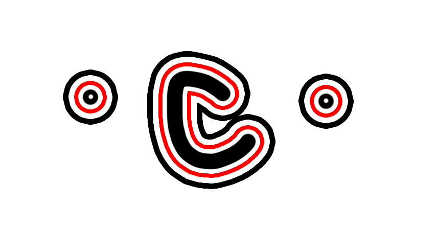](images/psd2png/ag-psd/multiple-strokes-test.png) | [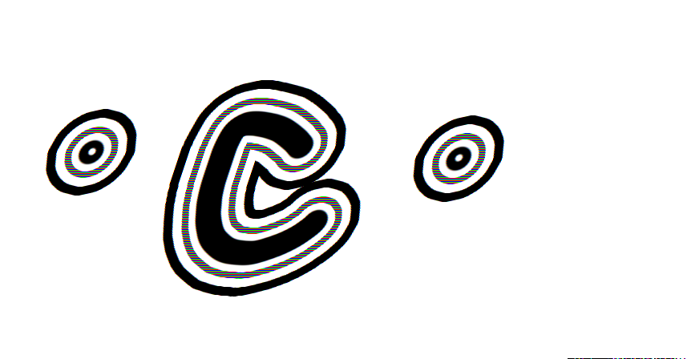](images/imagedata/ag-psd/multiple-strokes-test.png) |  |
| [write/groups/original.psd](https://github.com/Agamnentzar/ag-psd/tree/master/test/write/groups/original.psd) | 89.59%  | ⚠️ LOW |  |  | [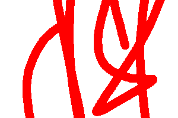](images/imagedata/ag-psd/write/groups/original_diff.png) |
| [read/smart-object/src.psd](https://github.com/Agamnentzar/ag-psd/tree/master/test/read/smart-object/src.psd) | 89.91%  | ⚠️ LOW |  |  |  |
| [read-write/smart/src.psd](https://github.com/Agamnentzar/ag-psd/tree/master/test/read-write/smart/src.psd) | 89.91%  | ⚠️ LOW |  |  | [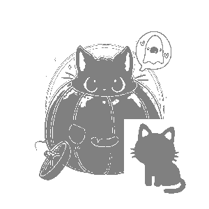](images/imagedata/ag-psd/read-write/smart/src_diff.png) |
| [read-write/smart/expected.psd](https://github.com/Agamnentzar/ag-psd/tree/master/test/read-write/smart/expected.psd) | 89.91%  | ⚠️ LOW |  |  | [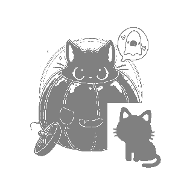](images/imagedata/ag-psd/read-write/smart/expected_diff.png) |
| [read-write/animation-frame/expected.psd](https://github.com/Agamnentzar/ag-psd/tree/master/test/read-write/animation-frame/expected.psd) | 90.90%  | ✅ GOOD |  |  | [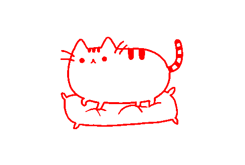](images/imagedata/ag-psd/read-write/animation-frame/expected_diff.png) |
| [read-write/animation-frame/src.psd](https://github.com/Agamnentzar/ag-psd/tree/master/test/read-write/animation-frame/src.psd) | 90.90%  | ✅ GOOD |  |  |  |
| [read/animation-frame/src.psd](https://github.com/Agamnentzar/ag-psd/tree/master/test/read/animation-frame/src.psd) | 90.90%  | ✅ GOOD |  |  |  |
| [read/cmyk/src.psd](https://github.com/Agamnentzar/ag-psd/tree/master/test/read/cmyk/src.psd) | 93.05%  | ✅ GOOD |  |  |  |
| [read-write/layer-comps/expected.psd](https://github.com/Agamnentzar/ag-psd/tree/master/test/read-write/layer-comps/expected.psd) | 96.46%  | ✅ GOOD |  |  |  |
| [read-write/layer-comps/src.psd](https://github.com/Agamnentzar/ag-psd/tree/master/test/read-write/layer-comps/src.psd) | 96.46%  | ✅ GOOD |  |  | [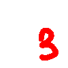](images/imagedata/ag-psd/read-write/layer-comps/src_diff.png) |
| [read/layer-comps/src.psd](https://github.com/Agamnentzar/ag-psd/tree/master/test/read/layer-comps/src.psd) | 96.46%  | ✅ GOOD |  |  |  |
| [read/alias/src.psd](https://github.com/Agamnentzar/ag-psd/tree/master/test/read/alias/src.psd) | 96.72%  | ✅ GOOD | [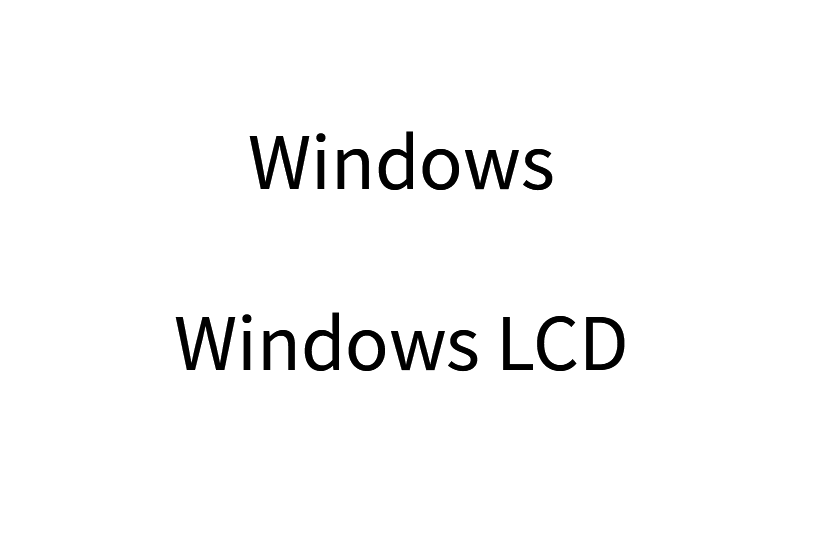](images/psd2png/ag-psd/read/alias/src.png) |  | [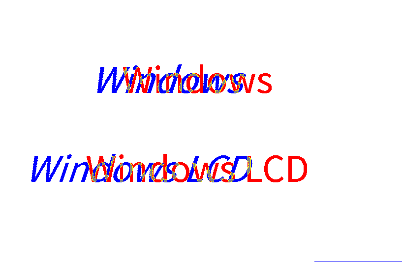](images/imagedata/ag-psd/read/alias/src_diff.png) |
| [read/text-paragraph-align/src.psd](https://github.com/Agamnentzar/ag-psd/tree/master/test/read/text-paragraph-align/src.psd) | 97.10%  | ✅ GOOD | [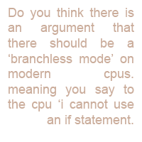](images/psd2png/ag-psd/read/text-paragraph-align/src.png) |  |  |
| [read-write/animation-effects/expected.psd](https://github.com/Agamnentzar/ag-psd/tree/master/test/read-write/animation-effects/expected.psd) | 97.51%  | ✅ GOOD |  |  | [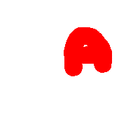](images/imagedata/ag-psd/read-write/animation-effects/expected_diff.png) |
| [read/animation-effects/src.psd](https://github.com/Agamnentzar/ag-psd/tree/master/test/read/animation-effects/src.psd) | 97.51%  | ✅ GOOD |  |  |  |
| [read-write/animation-effects/src.psd](https://github.com/Agamnentzar/ag-psd/tree/master/test/read-write/animation-effects/src.psd) | 97.51%  | ✅ GOOD |  |  |  |
| [read/animation-offset/src.psd](https://github.com/Agamnentzar/ag-psd/tree/master/test/read/animation-offset/src.psd) | 98.71%  | ✅ GOOD |  |  |  |
| [read-write/animation-offset/src.psd](https://github.com/Agamnentzar/ag-psd/tree/master/test/read-write/animation-offset/src.psd) | 98.71%  | ✅ GOOD |  |  |  |
| [read-write/animation-offset/expected.psd](https://github.com/Agamnentzar/ag-psd/tree/master/test/read-write/animation-offset/expected.psd) | 98.71%  | ✅ GOOD |  |  |  |
| [read/text-alternatives/src.psd](https://github.com/Agamnentzar/ag-psd/tree/master/test/read/text-alternatives/src.psd) | 99.35%  | ✅ PERFECT |  |  |  |
| [read/text-path/src.psd](https://github.com/Agamnentzar/ag-psd/tree/master/test/read/text-path/src.psd) | 99.69%  | ✅ PERFECT |  |  |  |
| [read/gradient/src.psd](https://github.com/Agamnentzar/ag-psd/tree/master/test/read/gradient/src.psd) | 99.77%  | ✅ PERFECT |  |  |  |
| [read-write/gradient/src.psd](https://github.com/Agamnentzar/ag-psd/tree/master/test/read-write/gradient/src.psd) | 99.77%  | ✅ PERFECT |  |  |  |
| [read-write/gradient/expected.psd](https://github.com/Agamnentzar/ag-psd/tree/master/test/read-write/gradient/expected.psd) | 99.77%  | ✅ PERFECT |  |  |  |
| [read/16bits/src.psd](https://github.com/Agamnentzar/ag-psd/tree/master/test/read/16bits/src.psd) | 99.80%  | ✅ PERFECT |  |  |  |
| [write/float-size/expected.psd](https://github.com/Agamnentzar/ag-psd/tree/master/test/write/float-size/expected.psd) | 99.84%  | ✅ PERFECT |  |  |  |
| [write/write-text/expected.psd](https://github.com/Agamnentzar/ag-psd/tree/master/test/write/write-text/expected.psd) | 99.87%  | ✅ PERFECT |  |  |  |
| [write/write-text2/expected.psd](https://github.com/Agamnentzar/ag-psd/tree/master/test/write/write-text2/expected.psd) | 99.87%  | ✅ PERFECT |  |  |  |
| [read/text-layer/src.psd](https://github.com/Agamnentzar/ag-psd/tree/master/test/read/text-layer/src.psd) | 99.87%  | ✅ PERFECT |  |  |  |
| [read/text-carriage-return/src.psd](https://github.com/Agamnentzar/ag-psd/tree/master/test/read/text-carriage-return/src.psd) | 99.92%  | ✅ PERFECT |  |  |  |
| [read-write/float-color/src.psd](https://github.com/Agamnentzar/ag-psd/tree/master/test/read-write/float-color/src.psd) | 99.95%  | ✅ PERFECT |  |  |  |
| [read-write/float-color/expected.psd](https://github.com/Agamnentzar/ag-psd/tree/master/test/read-write/float-color/expected.psd) | 99.95%  | ✅ PERFECT |  |  |  |
| [write/complex/expected.psd](https://github.com/Agamnentzar/ag-psd/tree/master/test/write/complex/expected.psd) | 100.00%  | ✅ PERFECT |  |  |  |
| [read/placed-transform/src.psd](https://github.com/Agamnentzar/ag-psd/tree/master/test/read/placed-transform/src.psd) | 100.00%  | ✅ PERFECT |  |  |  |
| [read/key-origin-shape-bbox/src.psd](https://github.com/Agamnentzar/ag-psd/tree/master/test/read/key-origin-shape-bbox/src.psd) | 100.00%  | ✅ PERFECT |  |  |  |
| [read/rle-fail/src.psd](https://github.com/Agamnentzar/ag-psd/tree/master/test/read/rle-fail/src.psd) | 100.00%  | ✅ PERFECT |  |  |  |
| [read/count/src.psd](https://github.com/Agamnentzar/ag-psd/tree/master/test/read/count/src.psd) | 100.00%  | ✅ PERFECT |  |  |  |
| [read/grayscale/src.psd](https://github.com/Agamnentzar/ag-psd/tree/master/test/read/grayscale/src.psd) | 100.00%  | ✅ PERFECT |  |  |  |
| [read/guides/src.psd](https://github.com/Agamnentzar/ag-psd/tree/master/test/read/guides/src.psd) | 100.00%  | ✅ PERFECT |  |  |  |
| [read/background/src.psd](https://github.com/Agamnentzar/ag-psd/tree/master/test/read/background/src.psd) | 100.00%  | ✅ PERFECT |  |  |  |
| [read/nested/src.psd](https://github.com/Agamnentzar/ag-psd/tree/master/test/read/nested/src.psd) | 100.00%  | ✅ PERFECT |  |  |  |
| [timeline.psd](https://github.com/Agamnentzar/ag-psd/tree/master/test/timeline.psd) | 100.00%  | ✅ PERFECT |  |  |  |
| [read/just-bg/src.psd](https://github.com/Agamnentzar/ag-psd/tree/master/test/read/just-bg/src.psd) | 100.00%  | ✅ PERFECT |  |  |  |
| [read/layer-larger-than-drawing/src.psd](https://github.com/Agamnentzar/ag-psd/tree/master/test/read/layer-larger-than-drawing/src.psd) | 100.00%  | ✅ PERFECT |  |  |  |
| [read-write/annotations/src.psd](https://github.com/Agamnentzar/ag-psd/tree/master/test/read-write/annotations/src.psd) | 100.00%  | ✅ PERFECT |  |  |  |
| [read-write/annotations/expected.psd](https://github.com/Agamnentzar/ag-psd/tree/master/test/read-write/annotations/expected.psd) | 100.00%  | ✅ PERFECT |  |  |  |
| [read-write/werps/src.psd](https://github.com/Agamnentzar/ag-psd/tree/master/test/read-write/werps/src.psd) | 100.00%  | ✅ PERFECT |  |  |  |
| [read/section-2/src.psd](https://github.com/Agamnentzar/ag-psd/tree/master/test/read/section-2/src.psd) | 100.00%  | ✅ PERFECT |  |  |  |
| [read/layers/src.psd](https://github.com/Agamnentzar/ag-psd/tree/master/test/read/layers/src.psd) | 100.00%  | ✅ PERFECT |  |  |  |
| [read-write/vectors/expected.psd](https://github.com/Agamnentzar/ag-psd/tree/master/test/read-write/vectors/expected.psd) | 100.00%  | ✅ PERFECT |  |  |  |
| [read-write/vectors/src.psd](https://github.com/Agamnentzar/ag-psd/tree/master/test/read-write/vectors/src.psd) | 100.00%  | ✅ PERFECT |  |  |  |
| [read/text-bug/src.psd](https://github.com/Agamnentzar/ag-psd/tree/master/test/read/text-bug/src.psd) | 100.00%  | ✅ PERFECT |  |  |  |
| [write/layer-color/expected.psd](https://github.com/Agamnentzar/ag-psd/tree/master/test/write/layer-color/expected.psd) | 100.00%  | ✅ PERFECT |  |  |  |
| [write/simple/expected.psd](https://github.com/Agamnentzar/ag-psd/tree/master/test/write/simple/expected.psd) | 100.00%  | ✅ PERFECT |  |  |  |
| [write/simple-compress/expected.psd](https://github.com/Agamnentzar/ag-psd/tree/master/test/write/simple-compress/expected.psd) | 100.00%  | ✅ PERFECT |  |  |  |
| [read-write/strokes/src.psd](https://github.com/Agamnentzar/ag-psd/tree/master/test/read-write/strokes/src.psd) | 100.00%  | ✅ PERFECT |  |  |  |
| [read-write/strokes/expected.psd](https://github.com/Agamnentzar/ag-psd/tree/master/test/read-write/strokes/expected.psd) | 100.00%  | ✅ PERFECT |  |  |  |
| [read/text-complex/src.psd](https://github.com/Agamnentzar/ag-psd/tree/master/test/read/text-complex/src.psd) | 100.00%  | ✅ PERFECT |  |  |  |
| [read/layer-offsets-read/src.psd](https://github.com/Agamnentzar/ag-psd/tree/master/test/read/layer-offsets-read/src.psd) | 100.00%  | ✅ PERFECT |  |  |  |
| [write/layer-offsets/expected.psd](https://github.com/Agamnentzar/ag-psd/tree/master/test/write/layer-offsets/expected.psd) | 100.00%  | ✅ PERFECT |  |  |  |
| [read-write/shapes/src.psd](https://github.com/Agamnentzar/ag-psd/tree/master/test/read-write/shapes/src.psd) | 100.00%  | ✅ PERFECT |  |  |  |
| [read-write/shapes/expected.psd](https://github.com/Agamnentzar/ag-psd/tree/master/test/read-write/shapes/expected.psd) | 100.00%  | ✅ PERFECT |  |  |  |
| [write/groups/expected.psd](https://github.com/Agamnentzar/ag-psd/tree/master/test/write/groups/expected.psd) | 100.00%  | ✅ PERFECT |  |  |  |
| [read/section/src.psd](https://github.com/Agamnentzar/ag-psd/tree/master/test/read/section/src.psd) | 100.00%  | ✅ PERFECT |  |  |  |

## Section 2: psd2png vs psdView

| File | Similarity | Status | psd2png | psdView | Difference |
|------|------------|--------|---------|---------|------------|
| [read/winding-even-odd/src.psd](https://github.com/Agamnentzar/ag-psd/tree/master/test/read/winding-even-odd/src.psd) | 5.24%  | ❌ FAILED |  |  |  |
| [read-write/stroke/src.psd](https://github.com/Agamnentzar/ag-psd/tree/master/test/read-write/stroke/src.psd) | 5.60%  | ❌ FAILED |  |  |  |
| [read-write/stroke/expected.psd](https://github.com/Agamnentzar/ag-psd/tree/master/test/read-write/stroke/expected.psd) | 5.60%  | ❌ FAILED |  |  |  |
| [read-write/winding-non-zero/src.psd](https://github.com/Agamnentzar/ag-psd/tree/master/test/read-write/winding-non-zero/src.psd) | 7.58%  | ❌ FAILED |  |  |  |
| [read-write/winding-non-zero/expected.psd](https://github.com/Agamnentzar/ag-psd/tree/master/test/read-write/winding-non-zero/expected.psd) | 7.58%  | ❌ FAILED |  |  |  |
| [read/winding-non-zero/src.psd](https://github.com/Agamnentzar/ag-psd/tree/master/test/read/winding-non-zero/src.psd) | 7.58%  | ❌ FAILED |  |  |  |
| [read/blend-mode/src.psd](https://github.com/Agamnentzar/ag-psd/tree/master/test/read/blend-mode/src.psd) | 11.56%  | ❌ FAILED |  |  |  |
| [read/adjustment-layers/src.psd](https://github.com/Agamnentzar/ag-psd/tree/master/test/read/adjustment-layers/src.psd) | 17.07%  | ❌ FAILED |  |  |  |
| [read-write/adjustments/src.psd](https://github.com/Agamnentzar/ag-psd/tree/master/test/read-write/adjustments/src.psd) | 17.07%  | ❌ FAILED |  |  |  |
| [read-write/adjustments/expected.psd](https://github.com/Agamnentzar/ag-psd/tree/master/test/read-write/adjustments/expected.psd) | 17.07%  | ❌ FAILED |  |  |  |
| [write/no-background/expected.psd](https://github.com/Agamnentzar/ag-psd/tree/master/test/write/no-background/expected.psd) | 24.79%  | ❌ FAILED |  |  |  |
| [read/bitmap-rle/src.psd](https://github.com/Agamnentzar/ag-psd/tree/master/test/read/bitmap-rle/src.psd) | 25.48%  | ❌ FAILED |  |  |  |
| [read-write/boolean/expected.psd](https://github.com/Agamnentzar/ag-psd/tree/master/test/read-write/boolean/expected.psd) | 25.96%  | ❌ FAILED |  |  |  |
| [read-write/boolean/src.psd](https://github.com/Agamnentzar/ag-psd/tree/master/test/read-write/boolean/src.psd) | 25.96%  | ❌ FAILED |  |  |  |
| [write/circle/expected.psd](https://github.com/Agamnentzar/ag-psd/tree/master/test/write/circle/expected.psd) | 27.94%  | ❌ FAILED |  |  |  |
| [write/group-blend/expected.psd](https://github.com/Agamnentzar/ag-psd/tree/master/test/write/group-blend/expected.psd) | 28.73%  | ❌ FAILED |  |  |  |
| [read-write/round/expected.psd](https://github.com/Agamnentzar/ag-psd/tree/master/test/read-write/round/expected.psd) | 34.70%  | ❌ FAILED |  |  |  |
| [read-write/round/src.psd](https://github.com/Agamnentzar/ag-psd/tree/master/test/read-write/round/src.psd) | 34.70%  | ❌ FAILED |  |  |  |
| [read/round/src.psd](https://github.com/Agamnentzar/ag-psd/tree/master/test/read/round/src.psd) | 34.70%  | ❌ FAILED |  |  |  |
| [read-write/vector-and-mask/expected.psd](https://github.com/Agamnentzar/ag-psd/tree/master/test/read-write/vector-and-mask/expected.psd) | 36.86%  | ❌ FAILED |  |  |  |
| [read-write/vector-and-mask/src.psd](https://github.com/Agamnentzar/ag-psd/tree/master/test/read-write/vector-and-mask/src.psd) | 36.86%  | ❌ FAILED |  |  |  |
| [read/vector-layer/src.psd](https://github.com/Agamnentzar/ag-psd/tree/master/test/read/vector-layer/src.psd) | 37.13%  | ❌ FAILED |  |  |  |
| [read/bitmap/src.psd](https://github.com/Agamnentzar/ag-psd/tree/master/test/read/bitmap/src.psd) | 39.45%  | ❌ FAILED |  |  |  |
| [read/text-simple2/src.psd](https://github.com/Agamnentzar/ag-psd/tree/master/test/read/text-simple2/src.psd) | 41.62%  | ❌ FAILED |  |  |  |
| [test.psd](https://github.com/Agamnentzar/ag-psd/tree/master/test/test.psd) | 57.12%  | ⚠️ LOW |  |  |  |
| [read/lantern/src.psd](https://github.com/Agamnentzar/ag-psd/tree/master/test/read/lantern/src.psd) | 58.15%  | ⚠️ LOW |  |  |  |
| [read/text-simple/src.psd](https://github.com/Agamnentzar/ag-psd/tree/master/test/read/text-simple/src.psd) | 62.26%  | ⚠️ LOW |  |  |  |
| [read/fill-opacity/src.psd](https://github.com/Agamnentzar/ag-psd/tree/master/test/read/fill-opacity/src.psd) | 62.45%  | ⚠️ LOW |  |  |  |
| [read/32bits/src.psd](https://github.com/Agamnentzar/ag-psd/tree/master/test/read/32bits/src.psd) | 62.71%  | ⚠️ LOW |  |  |  |
| [read/pattern/src.psd](https://github.com/Agamnentzar/ag-psd/tree/master/test/read/pattern/src.psd) | 63.88%  | ⚠️ LOW |  |  |  |
| [read-write/animation-timeline/expected.psd](https://github.com/Agamnentzar/ag-psd/tree/master/test/read-write/animation-timeline/expected.psd) | 64.09%  | ⚠️ LOW |  |  |  |
| [read-write/animation-timeline/src.psd](https://github.com/Agamnentzar/ag-psd/tree/master/test/read-write/animation-timeline/src.psd) | 64.09%  | ⚠️ LOW |  |  |  |
| [read/animation-timeline/src.psd](https://github.com/Agamnentzar/ag-psd/tree/master/test/read/animation-timeline/src.psd) | 64.09%  | ⚠️ LOW |  |  |  |
| [write/vector/expected.psd](https://github.com/Agamnentzar/ag-psd/tree/master/test/write/vector/expected.psd) | 64.71%  | ⚠️ LOW |  |  |  |
| [read/vector-complex/src.psd](https://github.com/Agamnentzar/ag-psd/tree/master/test/read/vector-complex/src.psd) | 65.05%  | ⚠️ LOW |  |  |  |
| [write/vector/src.psd](https://github.com/Agamnentzar/ag-psd/tree/master/test/write/vector/src.psd) | 65.05%  | ⚠️ LOW |  |  |  |
| [vector-test.psd](https://github.com/Agamnentzar/ag-psd/tree/master/test/vector-test.psd) | 65.86%  | ⚠️ LOW |  |  |  |
| [read-write/smart-filters/src.psd](https://github.com/Agamnentzar/ag-psd/tree/master/test/read-write/smart-filters/src.psd) | 66.80%  | ⚠️ LOW |  |  |  |
| [read-write/smart-filters/expected.psd](https://github.com/Agamnentzar/ag-psd/tree/master/test/read-write/smart-filters/expected.psd) | 66.80%  | ⚠️ LOW |  |  |  |
| [read/16bits/src.psd](https://github.com/Agamnentzar/ag-psd/tree/master/test/read/16bits/src.psd) | 68.18%  | ⚠️ LOW |  |  |  |
| [read/cmyk/src.psd](https://github.com/Agamnentzar/ag-psd/tree/master/test/read/cmyk/src.psd) | 68.28%  | ⚠️ LOW |  |  |  |
| [write/effects/expected.psd](https://github.com/Agamnentzar/ag-psd/tree/master/test/write/effects/expected.psd) | 72.05%  | ⚠️ LOW |  |  |  |
| [read-write/effects/src.psd](https://github.com/Agamnentzar/ag-psd/tree/master/test/read-write/effects/src.psd) | 72.17%  | ⚠️ LOW |  |  |  |
| [read-write/effects/expected.psd](https://github.com/Agamnentzar/ag-psd/tree/master/test/read-write/effects/expected.psd) | 72.17%  | ⚠️ LOW |  |  |  |
| [read/effects/src.psd](https://github.com/Agamnentzar/ag-psd/tree/master/test/read/effects/src.psd) | 72.33%  | ⚠️ LOW |  |  |  |
| [read-write/text/src.psd](https://github.com/Agamnentzar/ag-psd/tree/master/test/read-write/text/src.psd) | 73.66%  | ⚠️ LOW |  |  |  |
| [read-write/text/expected.psd](https://github.com/Agamnentzar/ag-psd/tree/master/test/read-write/text/expected.psd) | 73.66%  | ⚠️ LOW |  |  |  |
| [read-write/text-box/src.psd](https://github.com/Agamnentzar/ag-psd/tree/master/test/read-write/text-box/src.psd) | 74.02%  | ⚠️ LOW |  |  |  |
| [read-write/text-box/expected.psd](https://github.com/Agamnentzar/ag-psd/tree/master/test/read-write/text-box/expected.psd) | 74.02%  | ⚠️ LOW |  |  |  |
| [text-test.psd](https://github.com/Agamnentzar/ag-psd/tree/master/test/text-test.psd) | 74.19%  | ⚠️ LOW |  |  |  |
| [layer-mask/src.psd](https://github.com/Agamnentzar/ag-psd/tree/master/test/layer-mask/src.psd) | 74.32%  | ⚠️ LOW |  |  |  |
| [read/cat/src.psd](https://github.com/Agamnentzar/ag-psd/tree/master/test/read/cat/src.psd) | 74.32%  | ⚠️ LOW |  |  |  |
| [read-write/masks/expected.psd](https://github.com/Agamnentzar/ag-psd/tree/master/test/read-write/masks/expected.psd) | 74.50%  | ⚠️ LOW |  |  |  |
| [read-write/masks/src.psd](https://github.com/Agamnentzar/ag-psd/tree/master/test/read-write/masks/src.psd) | 74.50%  | ⚠️ LOW |  |  |  |
| [text-simple.psd](https://github.com/Agamnentzar/ag-psd/tree/master/test/text-simple.psd) | 74.57%  | ⚠️ LOW |  |  |  |
| [write/auto-lead/expected.psd](https://github.com/Agamnentzar/ag-psd/tree/master/test/write/auto-lead/expected.psd) | 75.00%  | ⚠️ LOW |  |  |  |
| [read/pass-through/src.psd](https://github.com/Agamnentzar/ag-psd/tree/master/test/read/pass-through/src.psd) | 75.00%  | ⚠️ LOW |  |  |  |
| [write/long-name/expected.psd](https://github.com/Agamnentzar/ag-psd/tree/master/test/write/long-name/expected.psd) | 75.00%  | ⚠️ LOW |  |  |  |
| [write/empty/expected.psd](https://github.com/Agamnentzar/ag-psd/tree/master/test/write/empty/expected.psd) | 75.00%  | ⚠️ LOW |  |  |  |
| [write/layer-name/expected.psd](https://github.com/Agamnentzar/ag-psd/tree/master/test/write/layer-name/expected.psd) | 75.00%  | ⚠️ LOW |  |  |  |
| [read/sai/src.psd](https://github.com/Agamnentzar/ag-psd/tree/master/test/read/sai/src.psd) | 76.08%  | ⚠️ LOW |  |  |  |
| [read/alpha-composite/src.psd](https://github.com/Agamnentzar/ag-psd/tree/master/test/read/alpha-composite/src.psd) | 76.13%  | ⚠️ LOW |  |  |  |
| [read/smart-object-png/src.psd](https://github.com/Agamnentzar/ag-psd/tree/master/test/read/smart-object-png/src.psd) | 76.29%  | ⚠️ LOW |  |  |  |
| [read/smart-object-png/expected.psd](https://github.com/Agamnentzar/ag-psd/tree/master/test/read/smart-object-png/expected.psd) | 76.29%  | ⚠️ LOW |  |  |  |
| [read/section/src.psd](https://github.com/Agamnentzar/ag-psd/tree/master/test/read/section/src.psd) | 76.57%  | ⚠️ LOW |  |  |  |
| [read/mesh-transform/src.psd](https://github.com/Agamnentzar/ag-psd/tree/master/test/read/mesh-transform/src.psd) | 78.45%  | ⚠️ LOW |  |  |  |
| [read-write/group-blend/src.psd](https://github.com/Agamnentzar/ag-psd/tree/master/test/read-write/group-blend/src.psd) | 80.53%  | ⚠️ LOW |  |  |  |
| [read-write/group-blend/expected.psd](https://github.com/Agamnentzar/ag-psd/tree/master/test/read-write/group-blend/expected.psd) | 80.53%  | ⚠️ LOW |  |  |  |
| [read-write/gradient-mode/src.psd](https://github.com/Agamnentzar/ag-psd/tree/master/test/read-write/gradient-mode/src.psd) | 82.57%  | ⚠️ LOW |  |  |  |
| [read-write/gradient-mode/expected.psd](https://github.com/Agamnentzar/ag-psd/tree/master/test/read-write/gradient-mode/expected.psd) | 82.57%  | ⚠️ LOW |  |  |  |
| [read/groups/src.psd](https://github.com/Agamnentzar/ag-psd/tree/master/test/read/groups/src.psd) | 83.14%  | ⚠️ LOW |  |  |  |
| [read/artboards/src.psd](https://github.com/Agamnentzar/ag-psd/tree/master/test/read/artboards/src.psd) | 83.27%  | ⚠️ LOW |  |  |  |
| [read-write/artboards/expected.psd](https://github.com/Agamnentzar/ag-psd/tree/master/test/read-write/artboards/expected.psd) | 83.27%  | ⚠️ LOW |  |  |  |
| [read-write/artboards/src.psd](https://github.com/Agamnentzar/ag-psd/tree/master/test/read-write/artboards/src.psd) | 83.27%  | ⚠️ LOW |  |  |  |
| [write/layer-mask/expected.psd](https://github.com/Agamnentzar/ag-psd/tree/master/test/write/layer-mask/expected.psd) | 86.18%  | ⚠️ LOW |  |  |  |
| [read/layer-mask/src.psd](https://github.com/Agamnentzar/ag-psd/tree/master/test/read/layer-mask/src.psd) | 86.18%  | ⚠️ LOW |  |  |  |
| [write/groups/expected.psd](https://github.com/Agamnentzar/ag-psd/tree/master/test/write/groups/expected.psd) | 87.19%  | ⚠️ LOW |  |  |  |
| [write/groups/original.psd](https://github.com/Agamnentzar/ag-psd/tree/master/test/write/groups/original.psd) | 87.19%  | ⚠️ LOW |  |  |  |
| [write/smart-object/expected.psd](https://github.com/Agamnentzar/ag-psd/tree/master/test/write/smart-object/expected.psd) | 87.23%  | ⚠️ LOW |  |  |  |
| [read-write/smart/expected.psd](https://github.com/Agamnentzar/ag-psd/tree/master/test/read-write/smart/expected.psd) | 87.23%  | ⚠️ LOW |  |  |  |
| [read-write/smart/src.psd](https://github.com/Agamnentzar/ag-psd/tree/master/test/read-write/smart/src.psd) | 87.23%  | ⚠️ LOW |  |  |  |
| [read/smart-object/src.psd](https://github.com/Agamnentzar/ag-psd/tree/master/test/read/smart-object/src.psd) | 87.23%  | ⚠️ LOW |  |  |  |
| [read-write/smart-filters-2/expected.psd](https://github.com/Agamnentzar/ag-psd/tree/master/test/read-write/smart-filters-2/expected.psd) | 90.55%  | ✅ GOOD |  |  |  |
| [read-write/smart-filters-2/src.psd](https://github.com/Agamnentzar/ag-psd/tree/master/test/read-write/smart-filters-2/src.psd) | 90.55%  | ✅ GOOD |  |  |  |
| [read-write/shapes/src.psd](https://github.com/Agamnentzar/ag-psd/tree/master/test/read-write/shapes/src.psd) | 91.48%  | ✅ GOOD |  |  |  |
| [read-write/shapes/expected.psd](https://github.com/Agamnentzar/ag-psd/tree/master/test/read-write/shapes/expected.psd) | 91.48%  | ✅ GOOD |  |  |  |
| [read/grayscale-alpha/src.psd](https://github.com/Agamnentzar/ag-psd/tree/master/test/read/grayscale-alpha/src.psd) | 93.41%  | ✅ GOOD |  |  |  |
| [read-write/gradient/src.psd](https://github.com/Agamnentzar/ag-psd/tree/master/test/read-write/gradient/src.psd) | 94.08%  | ✅ GOOD |  |  |  |
| [read/gradient/src.psd](https://github.com/Agamnentzar/ag-psd/tree/master/test/read/gradient/src.psd) | 94.08%  | ✅ GOOD |  |  |  |
| [read-write/animation-frame/expected.psd](https://github.com/Agamnentzar/ag-psd/tree/master/test/read-write/animation-frame/expected.psd) | 94.57%  | ✅ GOOD |  |  |  |
| [read-write/gradient/expected.psd](https://github.com/Agamnentzar/ag-psd/tree/master/test/read-write/gradient/expected.psd) | 95.05%  | ✅ GOOD |  |  |  |
| [multiple-strokes-test.psd](https://github.com/Agamnentzar/ag-psd/tree/master/test/multiple-strokes-test.psd) | 95.19%  | ✅ GOOD |  |  |  |
| [read/text-paragraph-align/src.psd](https://github.com/Agamnentzar/ag-psd/tree/master/test/read/text-paragraph-align/src.psd) | 96.03%  | ✅ GOOD |  |  |  |
| [write/layer-offsets/expected.psd](https://github.com/Agamnentzar/ag-psd/tree/master/test/write/layer-offsets/expected.psd) | 96.48%  | ✅ GOOD |  |  |  |
| [read/layer-offsets-read/src.psd](https://github.com/Agamnentzar/ag-psd/tree/master/test/read/layer-offsets-read/src.psd) | 96.48%  | ✅ GOOD |  |  |  |
| [read/alias/src.psd](https://github.com/Agamnentzar/ag-psd/tree/master/test/read/alias/src.psd) | 97.40%  | ✅ GOOD |  |  |  |
| [write/complex/expected.psd](https://github.com/Agamnentzar/ag-psd/tree/master/test/write/complex/expected.psd) | 97.85%  | ✅ GOOD |  |  |  |
| [read/text-complex/src.psd](https://github.com/Agamnentzar/ag-psd/tree/master/test/read/text-complex/src.psd) | 98.11%  | ✅ GOOD |  |  |  |
| [read-write/strokes/expected.psd](https://github.com/Agamnentzar/ag-psd/tree/master/test/read-write/strokes/expected.psd) | 98.12%  | ✅ GOOD |  |  |  |
| [read-write/strokes/src.psd](https://github.com/Agamnentzar/ag-psd/tree/master/test/read-write/strokes/src.psd) | 98.16%  | ✅ GOOD |  |  |  |
| [read/animation-effects/src.psd](https://github.com/Agamnentzar/ag-psd/tree/master/test/read/animation-effects/src.psd) | 98.45%  | ✅ GOOD |  |  |  |
| [read-write/animation-effects/src.psd](https://github.com/Agamnentzar/ag-psd/tree/master/test/read-write/animation-effects/src.psd) | 98.45%  | ✅ GOOD |  |  |  |
| [read-write/animation-effects/expected.psd](https://github.com/Agamnentzar/ag-psd/tree/master/test/read-write/animation-effects/expected.psd) | 98.45%  | ✅ GOOD |  |  |  |
| [write/write-text2/expected.psd](https://github.com/Agamnentzar/ag-psd/tree/master/test/write/write-text2/expected.psd) | 98.74%  | ✅ GOOD |  |  |  |
| [write/write-text/expected.psd](https://github.com/Agamnentzar/ag-psd/tree/master/test/write/write-text/expected.psd) | 98.74%  | ✅ GOOD |  |  |  |
| [read/text-layer/src.psd](https://github.com/Agamnentzar/ag-psd/tree/master/test/read/text-layer/src.psd) | 98.74%  | ✅ GOOD |  |  |  |
| [read/text-alternatives/src.psd](https://github.com/Agamnentzar/ag-psd/tree/master/test/read/text-alternatives/src.psd) | 99.09%  | ✅ PERFECT |  |  |  |
| [write/layer-color/expected.psd](https://github.com/Agamnentzar/ag-psd/tree/master/test/write/layer-color/expected.psd) | 99.17%  | ✅ PERFECT |  |  |  |
| [write/simple/expected.psd](https://github.com/Agamnentzar/ag-psd/tree/master/test/write/simple/expected.psd) | 99.17%  | ✅ PERFECT |  |  |  |
| [write/simple-compress/expected.psd](https://github.com/Agamnentzar/ag-psd/tree/master/test/write/simple-compress/expected.psd) | 99.17%  | ✅ PERFECT |  |  |  |
| [read-write/float-color/src.psd](https://github.com/Agamnentzar/ag-psd/tree/master/test/read-write/float-color/src.psd) | 99.24%  | ✅ PERFECT |  |  |  |
| [read-write/float-color/expected.psd](https://github.com/Agamnentzar/ag-psd/tree/master/test/read-write/float-color/expected.psd) | 99.24%  | ✅ PERFECT |  |  |  |
| [read/text-path/src.psd](https://github.com/Agamnentzar/ag-psd/tree/master/test/read/text-path/src.psd) | 99.48%  | ✅ PERFECT |  |  |  |
| [write/float-size/expected.psd](https://github.com/Agamnentzar/ag-psd/tree/master/test/write/float-size/expected.psd) | 99.81%  | ✅ PERFECT |  |  |  |
| [read/text-bug/src.psd](https://github.com/Agamnentzar/ag-psd/tree/master/test/read/text-bug/src.psd) | 99.85%  | ✅ PERFECT |  |  |  |
| [read-write/vectors/src.psd](https://github.com/Agamnentzar/ag-psd/tree/master/test/read-write/vectors/src.psd) | 99.89%  | ✅ PERFECT |  |  |  |
| [read/cyllinder-warp/src.psd](https://github.com/Agamnentzar/ag-psd/tree/master/test/read/cyllinder-warp/src.psd) | 99.95%  | ✅ PERFECT |  |  |  |
| [read/text-carriage-return/src.psd](https://github.com/Agamnentzar/ag-psd/tree/master/test/read/text-carriage-return/src.psd) | 99.95%  | ✅ PERFECT |  |  |  |
| [read-write/vectors/expected.psd](https://github.com/Agamnentzar/ag-psd/tree/master/test/read-write/vectors/expected.psd) | 99.97%  | ✅ PERFECT |  |  |  |
| [read-write/cyllinder-warp/src.psd](https://github.com/Agamnentzar/ag-psd/tree/master/test/read-write/cyllinder-warp/src.psd) | 99.99%  | ✅ PERFECT |  |  |  |
| [read-write/cyllinder-warp/expected.psd](https://github.com/Agamnentzar/ag-psd/tree/master/test/read-write/cyllinder-warp/expected.psd) | 99.99%  | ✅ PERFECT |  |  |  |
| [read/key-origin-shape-bbox/src.psd](https://github.com/Agamnentzar/ag-psd/tree/master/test/read/key-origin-shape-bbox/src.psd) | 100.00%  | ✅ PERFECT |  |  |  |
| [read/section-2/src.psd](https://github.com/Agamnentzar/ag-psd/tree/master/test/read/section-2/src.psd) | 100.00%  | ✅ PERFECT |  |  |  |
| [read-write/layer-comps/src.psd](https://github.com/Agamnentzar/ag-psd/tree/master/test/read-write/layer-comps/src.psd) | 100.00%  | ✅ PERFECT |  |  |  |
| [read/layer-comps/src.psd](https://github.com/Agamnentzar/ag-psd/tree/master/test/read/layer-comps/src.psd) | 100.00%  | ✅ PERFECT |  |  |  |
| [read-write/layer-comps/expected.psd](https://github.com/Agamnentzar/ag-psd/tree/master/test/read-write/layer-comps/expected.psd) | 100.00%  | ✅ PERFECT |  |  |  |
| [read-write/annotations/expected.psd](https://github.com/Agamnentzar/ag-psd/tree/master/test/read-write/annotations/expected.psd) | 100.00%  | ✅ PERFECT |  |  |  |
| [read/animation-frame/src.psd](https://github.com/Agamnentzar/ag-psd/tree/master/test/read/animation-frame/src.psd) | 100.00%  | ✅ PERFECT |  |  |  |
| [read-write/annotations/src.psd](https://github.com/Agamnentzar/ag-psd/tree/master/test/read-write/annotations/src.psd) | 100.00%  | ✅ PERFECT |  |  |  |
| [read/layers/src.psd](https://github.com/Agamnentzar/ag-psd/tree/master/test/read/layers/src.psd) | 100.00%  | ✅ PERFECT |  |  |  |
| [read-write/werps/src.psd](https://github.com/Agamnentzar/ag-psd/tree/master/test/read-write/werps/src.psd) | 100.00%  | ✅ PERFECT |  |  |  |
| [read/layer-larger-than-drawing/src.psd](https://github.com/Agamnentzar/ag-psd/tree/master/test/read/layer-larger-than-drawing/src.psd) | 100.00%  | ✅ PERFECT |  |  |  |
| [read/just-bg/src.psd](https://github.com/Agamnentzar/ag-psd/tree/master/test/read/just-bg/src.psd) | 100.00%  | ✅ PERFECT |  |  |  |
| [read/guides/src.psd](https://github.com/Agamnentzar/ag-psd/tree/master/test/read/guides/src.psd) | 100.00%  | ✅ PERFECT |  |  |  |
| [read/grayscale/src.psd](https://github.com/Agamnentzar/ag-psd/tree/master/test/read/grayscale/src.psd) | 100.00%  | ✅ PERFECT |  |  |  |
| [read/count/src.psd](https://github.com/Agamnentzar/ag-psd/tree/master/test/read/count/src.psd) | 100.00%  | ✅ PERFECT |  |  |  |
| [read/background/src.psd](https://github.com/Agamnentzar/ag-psd/tree/master/test/read/background/src.psd) | 100.00%  | ✅ PERFECT |  |  |  |
| [read/nested/src.psd](https://github.com/Agamnentzar/ag-psd/tree/master/test/read/nested/src.psd) | 100.00%  | ✅ PERFECT |  |  |  |
| [timeline.psd](https://github.com/Agamnentzar/ag-psd/tree/master/test/timeline.psd) | 100.00%  | ✅ PERFECT |  |  |  |
| [read/rle-fail/src.psd](https://github.com/Agamnentzar/ag-psd/tree/master/test/read/rle-fail/src.psd) | 100.00%  | ✅ PERFECT |  |  |  |
| [read/placed-transform/src.psd](https://github.com/Agamnentzar/ag-psd/tree/master/test/read/placed-transform/src.psd) | 100.00%  | ✅ PERFECT |  |  |  |
| [read/animation-offset/src.psd](https://github.com/Agamnentzar/ag-psd/tree/master/test/read/animation-offset/src.psd) | 100.00%  | ✅ PERFECT |  |  |  |
| [read-write/animation-offset/src.psd](https://github.com/Agamnentzar/ag-psd/tree/master/test/read-write/animation-offset/src.psd) | 100.00%  | ✅ PERFECT |  |  |  |
| [read-write/animation-offset/expected.psd](https://github.com/Agamnentzar/ag-psd/tree/master/test/read-write/animation-offset/expected.psd) | 100.00%  | ✅ PERFECT |  |  |  |
| [read-write/animation-frame/src.psd](https://github.com/Agamnentzar/ag-psd/tree/master/test/read-write/animation-frame/src.psd) | 100.00%  | ✅ PERFECT |  |  |  |
